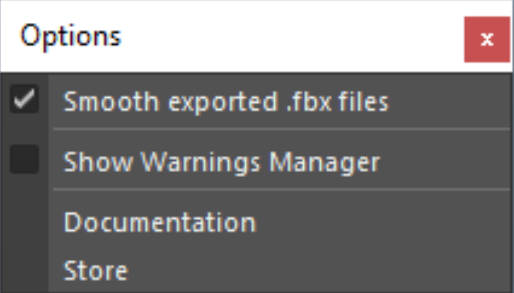
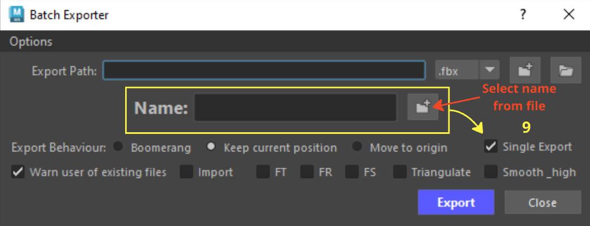

# **Buttons Overview**

{ .img-medium } 
## **Buttons**
1. Options  - Check the [options window buttons](#options-window-buttons) for more.

2. Export Path - Displays the path of your exported files in the textfield.
3. Dropdown menu - Choose between different file types to export.
4. Select Folder Path :material-folder-plus: - Opens up a window for users to navigate to a desired folder and export their files.
    1. Every time a file is exported the tool will store that Path, if the user saves the scene that path will be stored in the scene. If the user closes Maya and re-opens the Scene, opening the Batch Exporter tool will the last Path saved in the Export Path textfield.
    2. ++ctrl++ Click to reveal the last exported path (useful when jumping between different scenes).
    3. User can store up to two Paths:
        1. ++ctrl+shift++ Click to store a path.
        2. ++shift++ + Click to display the path in the Export textfield.
        3. ++ctrl+alt++ + Click to store a path.
        4. ++alt++ + Click to display the path in the Export textfield.
5. Open Folder Path in explorer :material-folder: - Opens the path set in the Export Path textfield.
6. Boomerang Export Behavior - Moves your Selected Objects to the World Origin, exports your files and moves them back to where they were.
7. Keep current position  - Exports your files from the Object's current position.
8. Move to Origin - Moves your selected Objects to the World Origin, exports your files and keeps them there.
9. Single Export - Exports a selection as a single file.
10. Warn user of existing files - does exactly as it says. Un-check to disable the warning.
11. Import - Batch Import selected files. Use the Export Path to Select files to Import.
12. Freeze transform options - Will freeze any transforms selected upon export.
    1. FT - Freeze Translate
    2. FR - Freeze Rotate
    3. FS - Freeze Scale
13. Triangulate - Triangulates your meshes before export. If Smooth exported .fbx files (from the Options menu) is checked the tool will export your smooth mesh preview Objects smoothed and triangulated. If Smooth_high checkbox is checked any Object with _high in its name will not be triangulated.
14. Smooth_high - Any Object in your scene that contains the name _high will have its smoothness display set to 3 and will be exported Smoothed. Any Objects with that contain the name _low will have their smoothness display set to 1. 
This is done so users wont have to worry about if their HP was smooth previewed before export, or if their LP had their smoothness display set to 1.
15. Export - Exports your selected Objects

### **Options Window**

{ .img-small}

- Smooth exported .fbx files - Allows the user to choose if they want their .fbx files to be smoothed upon export (Turning this off will still smooth your _high poly objects if Smooth_high checkbox is checked).
- Show Warnings Manager - will display any warnings during the export process (mainly any .fbx files that were smoothed upon export).
- Documentation - Opens a link to the documentation.
- Store - Opens a link to the store. 

### **Useful info**

???+ Info "Info - Decimated meshes from Zbrush"
    If your objects contains the name _dm_high or _zb_high (or _DM_high or _ZB_high) your objects will not be smoothed. 

    example. SM_Chair_01a_dm_high  
    
    This is done to avoid smoothing any decimated Zbrush files that were brought in Maya.
    
    Decimated files are dense in polycount and already triangulated - This can cause issues when being smoothed.

???+ Info "Info - Export Path Stored in Scene"
    Every time you click on the Export button, the path set in the Export Path textfield will be stored in the scene. 
    
    If the scene is saved then opening Maya for the first time to that scene and firing up the tool, will set that path in the textfield automatically. 

    Alternatively, if you open another Maya scene where you know a path is stored ++ctrl++ + Click on the Select Folder Path button to retrieve the path.

## **Single Export**

{ .img-medium } 

The single export checkbox allows you export multiple selected objects as once. 
Only thing you have to do is give your export a name and path. 

Single Export - When checking the Single Export checkbox you will see the Name textfield.  Use the textfield to type in the desired name for your exported Objects.

The folder icon :material-folder-plus: will open the folder path that is set up by the Export Path.
Use it to click on an existing file to retrieve its name (this is added to avoid spelling mistakes and ensure your files will always be named correctly).

???+ note
    
    The only export behavior that will work when **Single Export** is checked, is **Keep Current Position.** 
    
    Other behaviors like **Boomerang** or **Move to Origin** if checked will be ignored.

    **Freeze Transforms** will also not work whilst Single Export is checked.

