# **<span style="color:rgb(221, 137, 59);">Create Shelf Buttons / Hotkeys</span>** :tools:


All tools are acompanied with instructions on how to setup and activate using the accompanied code in Maya. 

To get the most out of these and boost your productivity, you will need to either create a shelf button or a hotkey in the hotkey editor in Maya.


## **<span style="color:rgb(199, 192, 99);">Creating a Shelf Button</span>**

For this example we will use the  [Bevel](../Free%20Tools/Bevel%20Tool/Bevel.md) mel code provided in the Free Tools section.
??? Info "Info - Mel / Python source"
    The programming language will always be either **Mel** or **Python**.
    Please refer to each tool's page to tell you which which programming language to use during the installation process *(refer to the installation page of each tool for detailed instructions).* 

``` mel linenums="1"
    dR_DoCmd("bevelPress");
    string $getBevelNode[] = `listHistory -lv 1`;
    setAttr ($getBevelNode[1] + ".subdivideNgons") 1;
```

**Copy** these 3 lines of code and open **Maya**.

In Maya there's different ways to create a shelf button.

### <span style="color:rgb(199, 192, 99);">**From the main viewport**</span>
Creating a shelf button using the **Mel** (or) **Python** execution of the command line source.

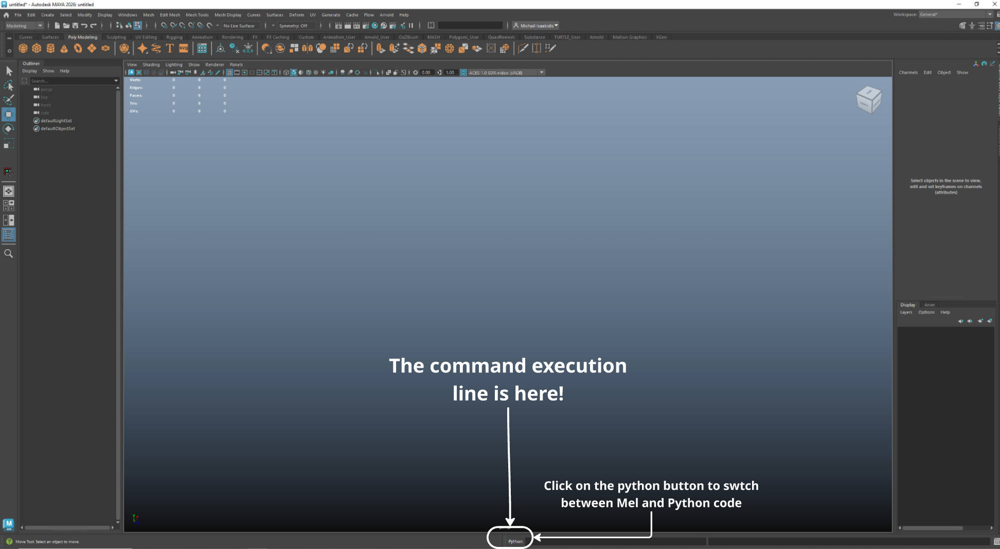{ .img-medium}

??? Info "Info - Mel / Python source"
    You can switch between **Mel** and **Python** languages by clicking on the name.

    Each tool's page will tell you which which programming language to use during the installation process *(please refer to the installation page of each specific tool for detailed instructions).*

    Switching bewteen Maya/Python is not that necessary at this moment as Maya will prompt us to choose the language we want to use later.

Set the command line source is set to **Mel** *(as that is the programming language used for this specific tool)* and paste in the code.

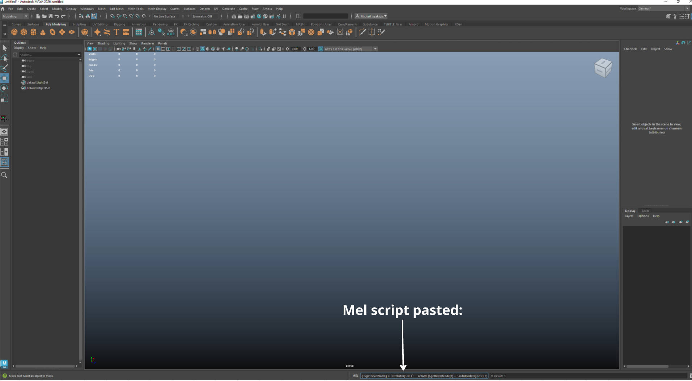{ .img-medium}

From here select/highlight the code *(++ctrl++ + a)* then <kbd>Middle Mouse</kbd> drag the text on your shelf. 

Once dragged a pop up window will appear *'Save script to shelf as type:'* since our code is in mel select <span style="color:rgb(99, 154, 199);">**Mel**</span>.

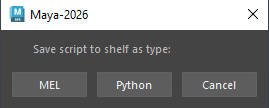{ .img-small}
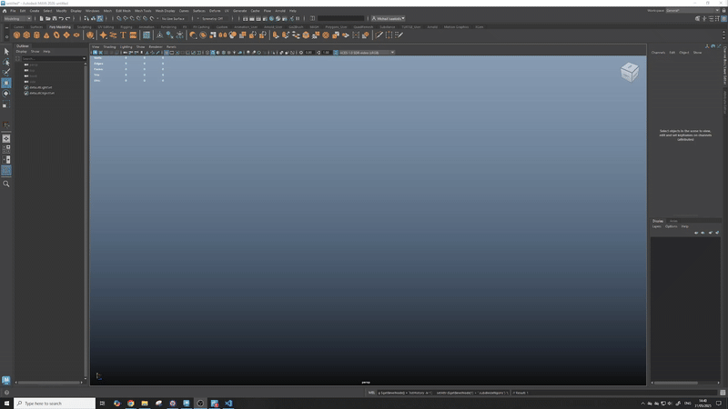{ .img-medium} 

Your Shelf button is now created and you can now activate the tool by clicking on the button. 
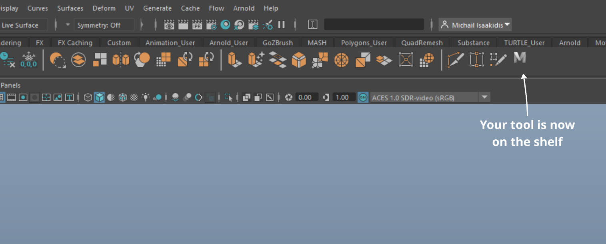{ .img-medium}
{ .img-medium} 

??? Info "Info - Command Line"
    If you are missing the command line at the bottom of Maya's interface, go to <span style="color:rgb(99, 154, 199);">**Windows**</span> :arrow_right: <span style="color:rgb(99, 154, 199);">**UI Elements**</span> :arrow_right: and make sure <span style="color:rgb(99, 154, 199);">**Command Line**</span> checkbox is checked.

    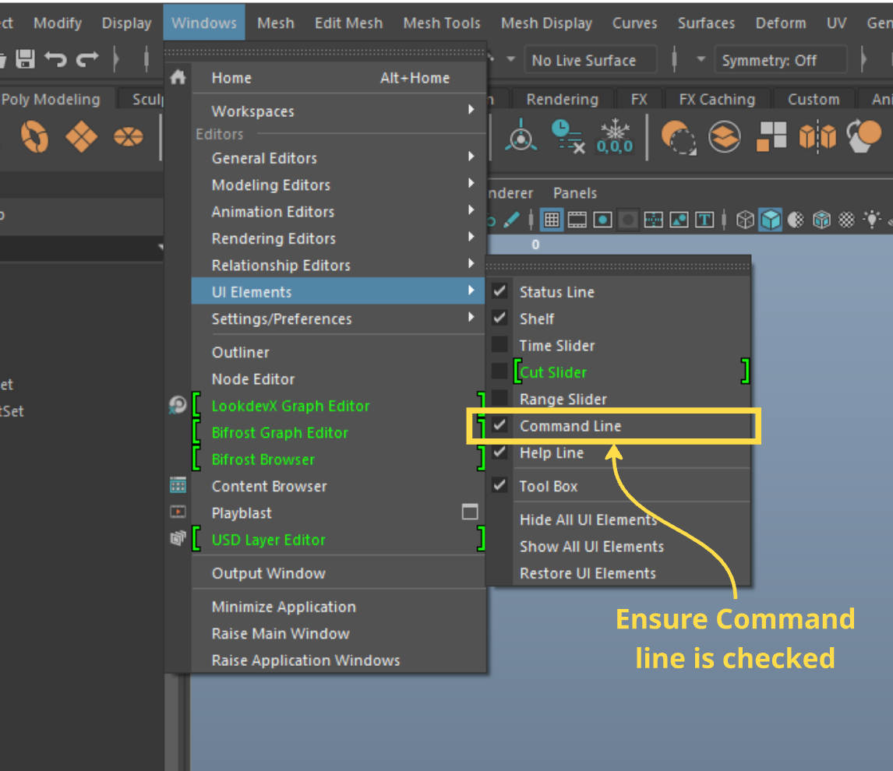{ .img-medium}

### **<span style="color:rgb(199, 192, 99);">From the script editor</span>**

The process of creating a shelf buton from the script editor is quite the same as above. 

1. Open the script editor.
    1. Go to <span style="color:rgb(99, 154, 199);">**Windows**</span> :arrow_right: <span style="color:rgb(99, 154, 199);">**General Editors**</span> :arrow_right: <span style="color:rgb(99, 154, 199);">**Script Editor**</span> to open the script editor.
    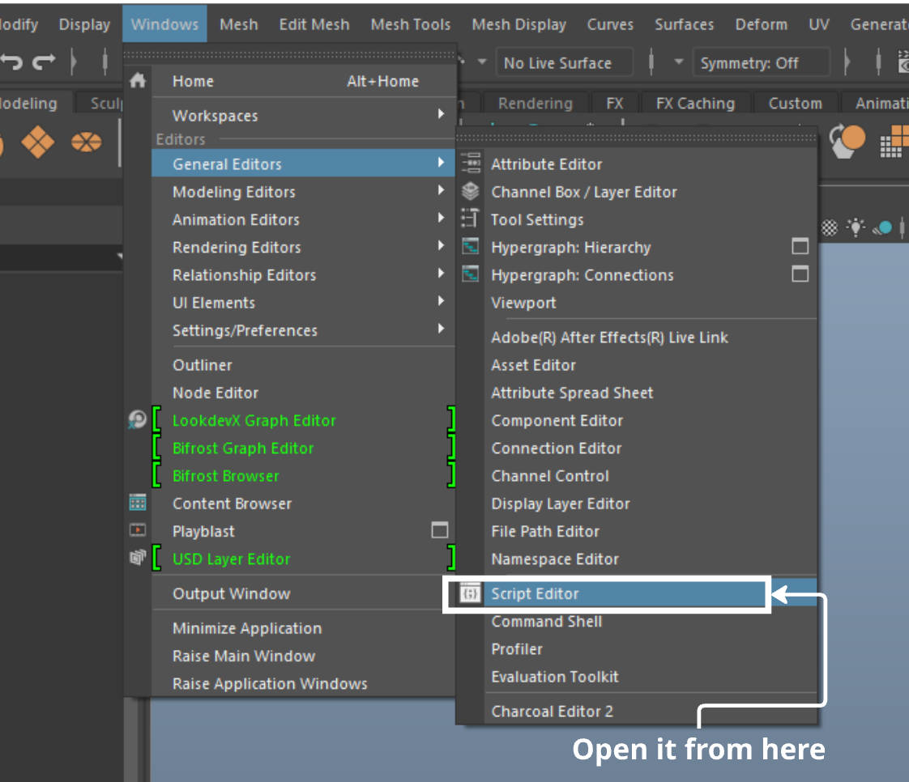{ .img-medium}
    2. or open it from the **bottom right** corner of your **Maya** window.
    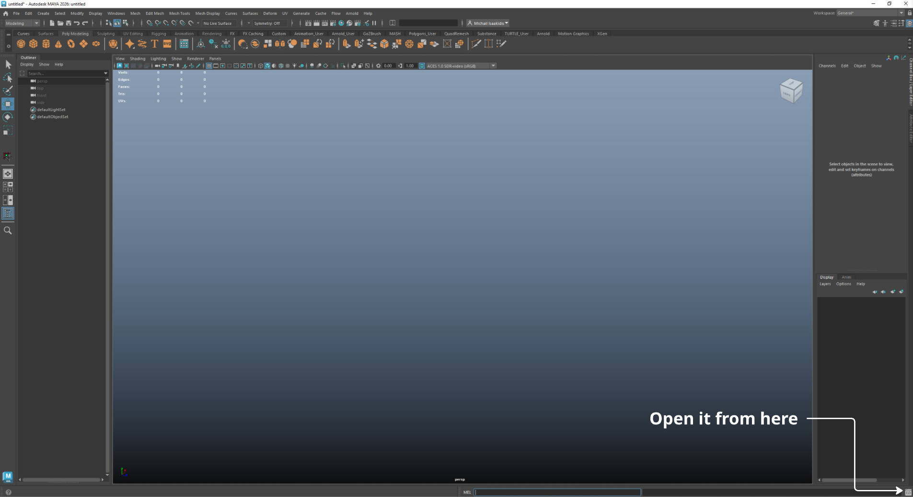{ .img-medium}

The script editor window should pop up. 
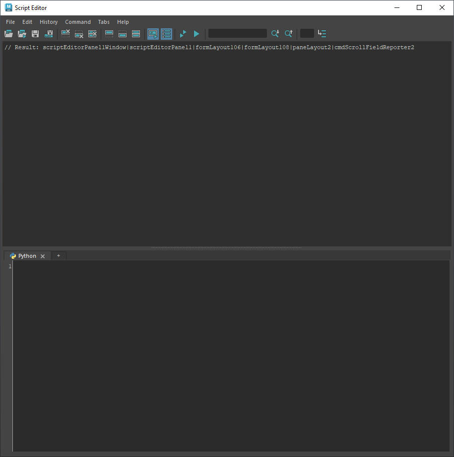{ .img-medium}

- Right Click on the bottom half section of the script editor and create a new <span style="color:rgb(99, 199, 149);">**Mel**</span> tab.
???+ Info "Info - Python/Mel tabs"
    Each tool's page will tell you which which programming language to use during the installation process *(please refer to the installation page of each specific tool for detailed instructions).*

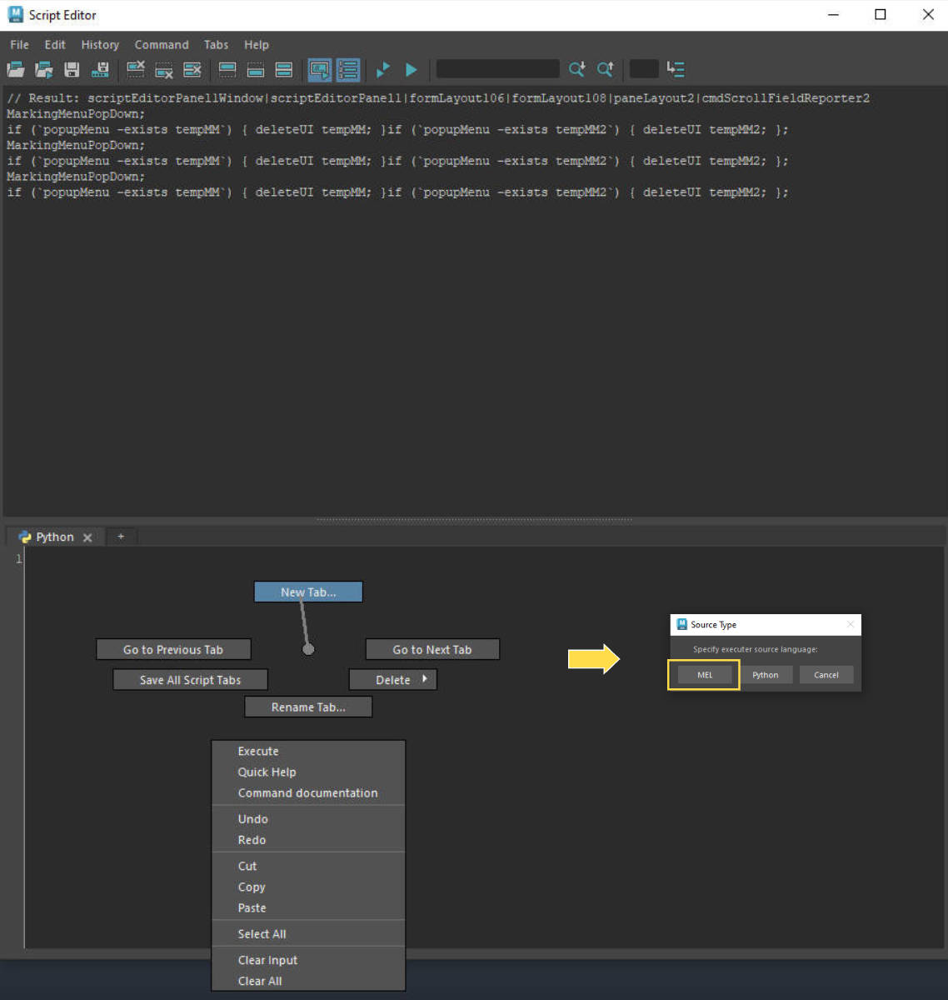{ .img-medium}

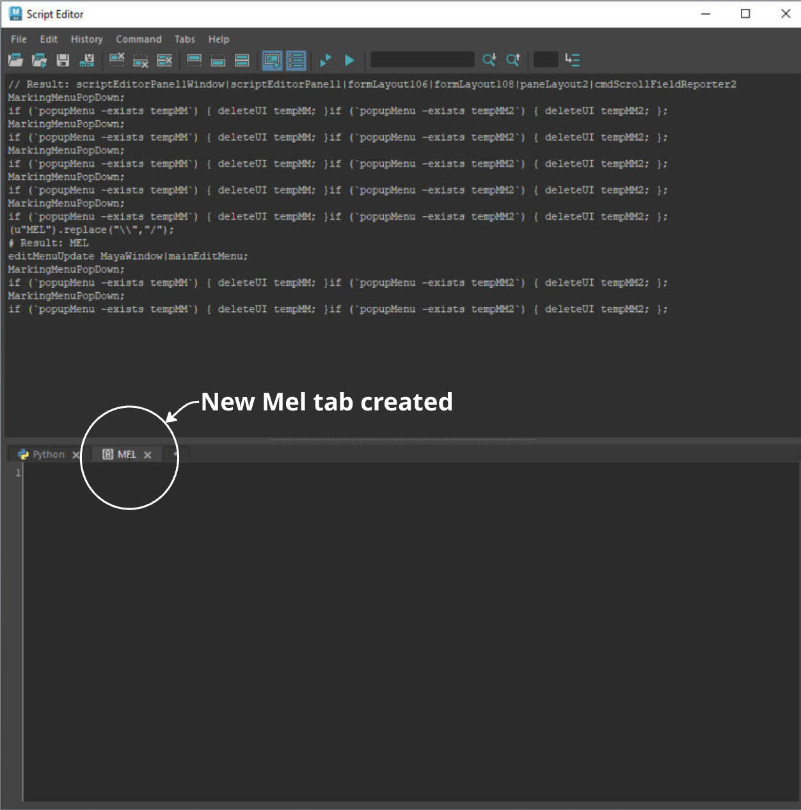{ .img-medium}

- Copy paste in the  <span style="color:rgb(99, 199, 149);">**Mel**</span> script.
- Highlight/Select the text (++ctrl++ + a).
- <kbd>Middle Mouse</kbd> drag the text on your shelf. 

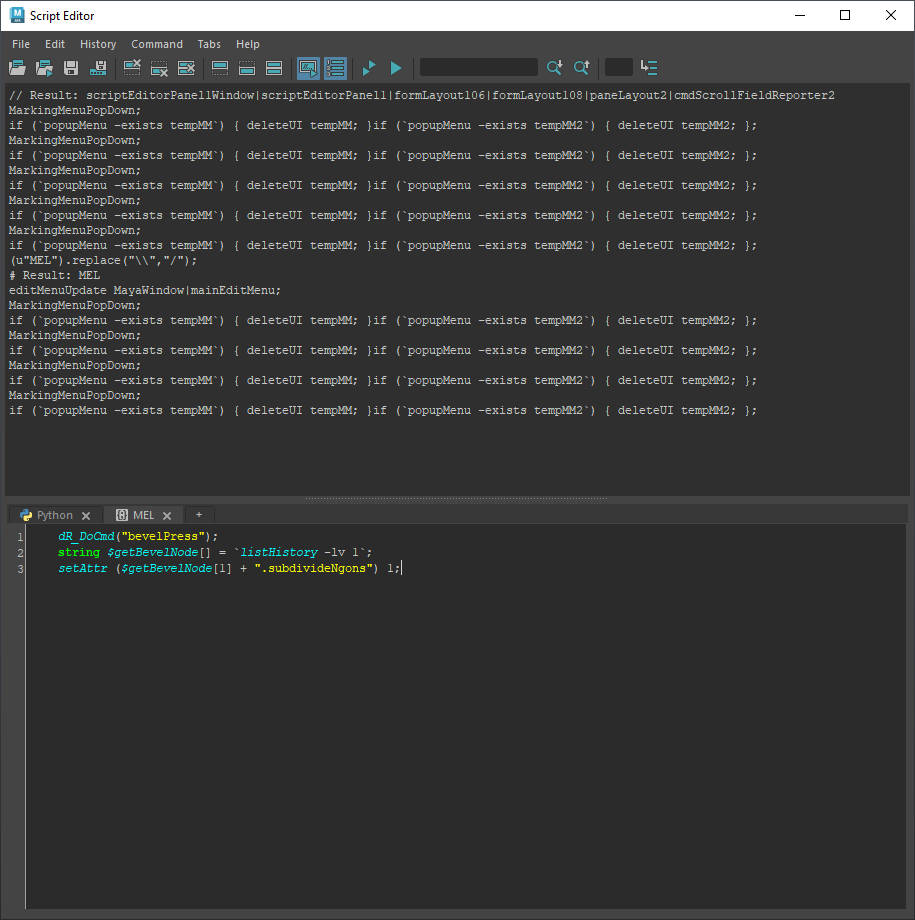{ .img-medium}

**Maya** knows its a **mel** script and will create the **shelf button** for us.

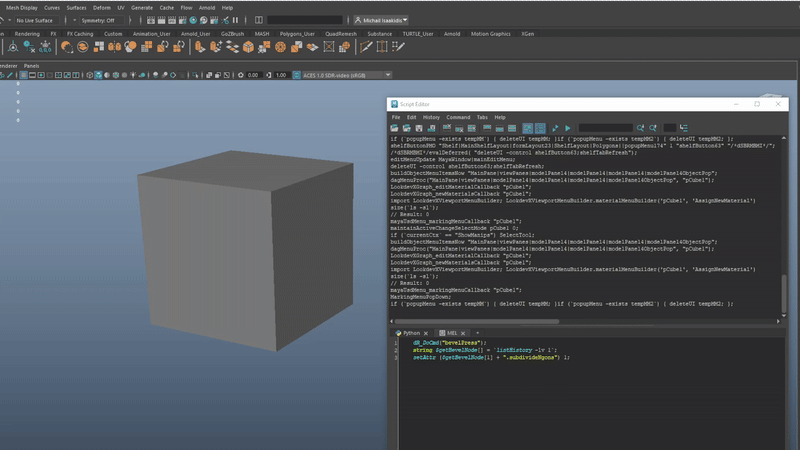{ .img-medium} 
{ .img-medium} 


## **<span style="color:rgb(199, 192, 99);">Adding a custom icon for your Shelf Button</span>** 

Occasionally tools will be shipped with an icon. You can use that icon to add it on your shelf button.

Let see how to set that up.


## **<span style="color:rgb(199, 192, 99);">Create a Hotkey</span>**

<!-- [Single Export](../Batch%20Exporter/Buttons_overview.md#single-export){ .md-button .md-button--primary } example of button link to a permalink!!!! -->
